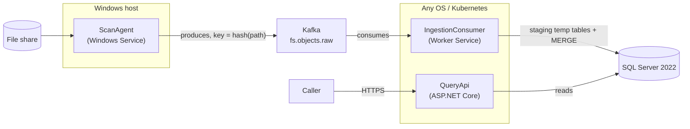

# Architecture

This is the current-state architecture reference for the code in this repository (Phase 1 MVP). For the full reasoning behind each decision, see:

- [`windows-fs-permission-scanner-plan.md`](windows-fs-permission-scanner-plan.md) — the full billion-object platform this is scoped down from
- [`scan-ingestion-kafka-sqlserver-deep-dive.md`](scan-ingestion-kafka-sqlserver-deep-dive.md) — Kafka producer/consumer/SQL Server mechanics in depth
- [`language-comparison-and-technical-design.md`](language-comparison-and-technical-design.md) — language choice and the original Phase 1 design (including the bugs found and fixed during implementation — worth reading if you're touching the ingestion path)

## Components

| Component | What it does | Runs on |
|---|---|---|
| `ScanAgent` | Walks one file share via a work-stealing directory queue; reads each object's security descriptor (`FILE_FLAG_BACKUP_SEMANTICS` + `SeBackupPrivilege`); publishes one Kafka message per object | Windows only |
| `IngestionConsumer` | Batches Kafka messages, bulk-loads into per-connection temp tables, calls `usp_MergeFsObjectsBatch` | Any OS |
| `QueryApi` | Answers `GET /api/v1/access/folder?path=...` by looking up `FsObjects` and its resolved `SecurityDescriptor` | Any OS |
| `Shared` | Kafka message contracts (`ObjectRecord`, `SecurityDescriptorRecord`, `AceRecord`), `PathNormalizer`, `HashUtil` — the single source of truth both the producer and query sides depend on so hashing can't drift apart | Any OS |

## Data flow

1. **Scan**: `ScanAgent` claims a directory from its in-process work-stealing queue, lists its children, and for each one reads the security descriptor and publishes an `ObjectRecord` to `fs.objects.raw`, keyed by `hash(normalized path)`. New descriptors (not yet reported by this agent in the current run) carry their full ACE list; already-seen descriptors only carry their hash.
2. **Ingest**: `IngestionConsumer` batches messages (5,000 or 2 seconds, whichever first), opens one `SqlConnection` for the whole batch, creates three **local temp tables** on it (`#FsObjectsStaging`, `#SecurityDescriptorsStaging`, `#SecurityDescriptorAcesStaging`), bulk-loads the batch via `SqlBulkCopy`, then calls `usp_MergeFsObjectsBatch` on the same connection.
3. **Merge** (inside the stored procedure, one transaction): descriptors first (`MERGE ... WITH (HOLDLOCK)`, capturing newly-inserted `DescriptorId`s), then their ACEs, then objects (`MERGE ... WITH (HOLDLOCK)`, resolving `DescriptorHash → DescriptorId`), then a `ParentObjectId` reconciliation pass.
4. **Commit**: only after the merge transaction commits does the consumer commit its Kafka offset — a crash mid-batch just replays the same (idempotent) batch.
5. **Query**: `QueryApi` normalizes the requested path the same way `ScanAgent`/`IngestionConsumer` did, hashes it, looks up `FsObjects` by `PathHash`, fetches the resolved descriptor's ACEs, resolves trustee SIDs to display names (cached, TTL'd), and returns the response.

## Data model

| Table | Grain | Notes |
|---|---|---|
| `SecurityDescriptors` | One row per **distinct** DACL/owner combination | The dedup point — most objects in a real file tree share a small number of descriptors via inheritance |
| `SecurityDescriptorAces` | One row per ACE | Immutable per descriptor once written (same hash ⇒ same DACL) |
| `FsObjects` | One row per file/folder | `DescriptorId` always points at the *resolved* descriptor (its own, or the nearest ancestor's) — the query path never walks the tree at read time |
| `SidNameCache` | One row per SID | TTL'd cache in front of the AD/LDAP lookup |

`FsObjects.PathHash` (`BINARY(32)`, SHA-256 of the normalized path) is the lookup key everywhere — there is deliberately **no index on `FullPath`**: SQL Server's nonclustered index key limit is 1,700 bytes, and `NVARCHAR(4000)` allows up to 8,000; an earlier draft had this index and it would fail at insert time on any real path over ~850 characters. Confirmed against a live SQL Server 2022 instance during development.

## Concurrency and idempotency

- **Staging is session-scoped.** All three staging tables are local temp tables (`#`-prefixed), created fresh per batch on the consumer's own connection. Multiple `IngestionConsumer` instances can run concurrently with zero coordination — no `BatchId` column, nothing for one consumer to accidentally clear out from under another.
- **`MERGE ... WITH (HOLDLOCK)`** on both `SecurityDescriptors` and `FsObjects` — without it, two consumers hitting the same common descriptor hash at the same moment can both decide "doesn't exist yet" and both try to insert, throwing a unique-constraint violation. `MergeRunner` also retries on deadlock (SQL error 1205) via Polly.
- **Path normalization uppercases the entire path**, not just the host/share segment — NTFS/SMB paths are case-insensitive end-to-end, so partial normalization would hash the same object two different ways depending on casing.
- **`ParentObjectId` resolves in two steps**, not one: inline during the merge if the parent row already exists, otherwise a reconciliation `UPDATE` catches it once the parent's own batch lands (parent and child can land on different Kafka partitions with no ordering guarantee between them, since the partition key is `hash(path)`).

## API surface

| Endpoint | Purpose |
|---|---|
| `GET /api/v1/access/folder?path={path}` | Who has access to this folder/file, as of the last scan |
| `GET /api/v1/objects/{objectId}` | Raw object metadata |
| `GET /health/live` | Liveness — no dependency checks |
| `GET /health/ready` | Readiness — checks SQL Server connectivity |

Liveness and readiness are deliberately separate endpoints: a transient SQL Server blip should take the pod out of load-balancing rotation (readiness), not cause Kubernetes to restart an otherwise-healthy process (liveness).

## What's explicitly out of scope here

- Full nested Active Directory group expansion (`tokenGroups`-based closure) — `QueryApi` returns ACEs as recorded, including group SIDs, not the fully expanded set of individual members.
- The materialized reverse index / OLAP tier for "what can user Y reach anywhere" at billion-object scale.
- Multi-share, multi-agent distributed work-stealing (the schema and Kafka design already support it — `ShareName` on every object, path-hash keying agent-agnostic — but this repo's `ScanAgent` runs one share per process).

See `language-comparison-and-technical-design.md` §9 for the full list and the reasoning behind each cut.
